# spark-core 学习记录
视频课程：[尚硅谷大数据Spark教程从入门到精通](https://www.bilibili.com/video/BV11A411L7CK)

[TOC]

#### [022.尚硅谷_SparkCore - 分布式计算模拟 - 搭建基础的架子](https://www.bilibili.com/video/BV11A411L7CK?p=22)
测试：
先启动 Executor (socket服务端)，再启动 Driver（socket客户端）
Executor (socket服务端)控制台输出：
```log
服务器启动，等待接收数据
接收到客户端发送的数据: 2
```
Driver（socket客户端）控制台输出：
```log
客户端数据发送完毕
```
#### [023.分布式计算模拟 - 客户端向服务器发送计算任务](https://www.bilibili.com/video/BV11A411L7CK?p=23)
测试：
先启动 Executor (socket服务端)，再启动 Driver（socket客户端）
Executor (socket服务端)控制台输出：

```log
服务器启动，等待接收数据
计算节点的计算结果为：List(2, 4, 6, 8)
```
Driver（socket客户端）控制台输出：
```log
客户端数据发送完毕
```
#### [024.分布式计算模拟 - 数据结构和分布式计算](https://www.bilibili.com/video/BV11A411L7CK?p=24)
测试：
先启动 Executor 和 Executor2， 再启动 Driver（socket客户端）
Driver（socket客户端）控制台输出：
```log
客户端数据发送完毕
```
Executor 控制台输出：
```log
服务器启动，等待接收数据
计算节点[9999]的计算结果为：List(2, 4)
```
Executor2 控制台输出：
```log
服务器启动，等待接收数据
计算节点[8888]的计算结果为：List(6, 8)
```
#### [032.核心编程 - RDD - 创建 - 内存](https://www.bilibili.com/video/BV11A411L7CK?p=32)
#### [033.核心编程 - RDD - 创建 - 文件](https://www.bilibili.com/video/BV11A411L7CK?p=33)
#### [034.核心编程 - RDD - 创建 - 文件1](https://www.bilibili.com/video/BV11A411L7CK?p=34)
#### [035.RDD - 集合数据源 - 分区的设定](https://www.bilibili.com/video/BV11A411L7CK?p=35)
#### [036.RDD - 集合数据源 - 分区数据的分配](https://www.bilibili.com/video/BV11A411L7CK?p=36)
指定并行分区数为2 
```scala
val rdd: RDD[Int] = sc.makeRDD(List(1, 2, 3, 4), 2)
```
运行程序后，在output目录下生成了2个分区文件
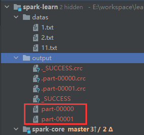
#### [037.SparkCore - 核心编程 - RDD - 文件数据源 - 分区的设定](https://www.bilibili.com/video/BV11A411L7CK?p=37)
#### [038.SparkCore - 核心编程 - RDD - 文件数据源 - 分区数据的分配](https://www.bilibili.com/video/BV11A411L7CK?p=38)
#### [039.SparkCore - 核心编程 - RDD - 文件数据源 - 分区数据的分配 - 案例分析](https://www.bilibili.com/video/BV11A411L7CK?p=39)
#### [040.SparkCore - 核心编程 - RDD - 算子介绍](https://www.bilibili.com/video/BV11A411L7CK?p=40)
#### [041.SparkCore - 核心编程 - RDD - 转换算子 - map](https://www.bilibili.com/video/BV11A411L7CK?p=41)
#### [042.SparkCore - 核心编程 - RDD - 转换算子 - map - 小功能](https://www.bilibili.com/video/BV11A411L7CK?p=42)
#### [043.SparkCore - 核心编程 - RDD - 转换算子 - map - 并行计算效果演示](https://www.bilibili.com/video/BV11A411L7CK?p=43)
#### [044.SparkCore - 核心编程 - RDD - 转换算子 - mapPartitions](https://www.bilibili.com/video/BV11A411L7CK?p=44)
运行 Spark02_RDD_Operator_Transform 结果：
由于指定了两个分区，因此会有连个迭代器在执行，控制台中会打印两次 >>>>>>>>>>
```log
>>>>>>>>>>
>>>>>>>>>>
2
4
6
8
```
#### [045.SparkCore - 核心编程 - RDD - 转换算子 - mapPartitions - 小练习](https://www.bilibili.com/video/BV11A411L7CK?p=45)


#### [046.SparkCore - 核心编程 - RDD - 转换算子 - mapPartitions & map的区别 - 完成比完美更重要](https://www.bilibili.com/video/BV11A411L7CK?p=46)
#### [047.SparkCore - 核心编程 - RDD - 转换算子 - mapPartitionsWithIndex](https://www.bilibili.com/video/BV11A411L7CK?p=47)
#### [048.SparkCore - 核心编程 - RDD - 转换算子 - flatMap](https://www.bilibili.com/video/BV11A411L7CK?p=48)
#### [049.SparkCore - 核心编程 - RDD - 转换算子 - flatMap - 小练习](https://www.bilibili.com/video/BV11A411L7CK?p=49)
#### [050.SparkCore - 核心编程 - RDD - 转换算子 - glom](https://www.bilibili.com/video/BV11A411L7CK?p=50)
原始数据，分区数指定为2 后输出到output分区文件中如下：
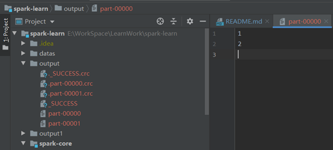
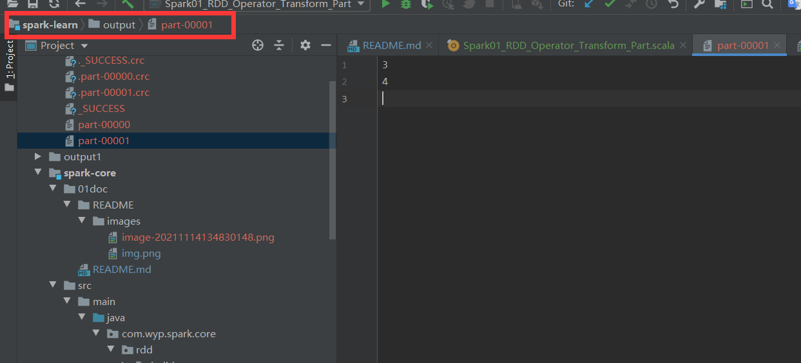
进过map算子操作后，输出到output1分区文件中如下
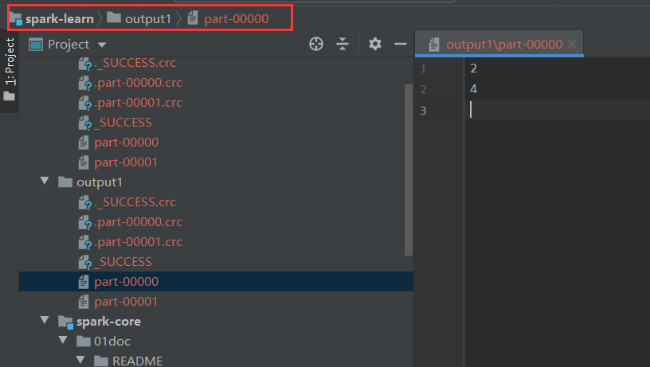
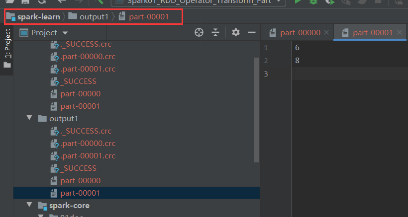
#### [051.SparkCore - 核心编程 - RDD - 转换算子 - 理解分区不变的含义](https://www.bilibili.com/video/BV11A411L7CK?p=51)
#### [052.SparkCore - 核心编程 - RDD - 转换算子 - groupBy](https://www.bilibili.com/video/BV11A411L7CK?p=52)
#### [053.SparkCore - 核心编程 - RDD - 转换算子 - groupBy - shuffle来袭](https://www.bilibili.com/video/BV11A411L7CK?p=53)
#### [054.SparkCore - 核心编程 - RDD - 转换算子 - groupBy - 小练习](https://www.bilibili.com/video/BV11A411L7CK?p=54)
#### [055.SparkCore - 核心编程 - RDD - 转换算子 - filter - 数据倾斜](https://www.bilibili.com/video/BV11A411L7CK?p=55)
#### [056.SparkCore - 核心编程 - RDD - 转换算子 - sample - 抽奖喽](https://www.bilibili.com/video/BV11A411L7CK?p=56)
#### [057.SparkCore - 核心编程 - RDD - 转换算子 - distinct](https://www.bilibili.com/video/BV11A411L7CK?p=57)
#### [058.SparkCore - 核心编程 - RDD - 转换算子 - coalesce](https://www.bilibili.com/video/BV11A411L7CK?p=58)
#### [059.SparkCore - 核心编程 - RDD - 转换算子 - repartition](https://www.bilibili.com/video/BV11A411L7CK?p=59)
#### [060.SparkCore - 核心编程 - RDD - 转换算子 - sortBy](https://www.bilibili.com/video/BV11A411L7CK?p=60)
#### [061.SparkCore - 核心编程 - RDD - 转换算子 - 交集&并集&差集&拉链](https://www.bilibili.com/video/BV11A411L7CK?p=61)
#### [062.SparkCore - 核心编程 - RDD - 转换算子 - 交集&并集&差集&拉链 - 注意事项](https://www.bilibili.com/video/BV11A411L7CK?p=62)
#### [063.SparkCore - 核心编程 - RDD - 转换算子 - partitionBy（前面有吸气，中间有等待）](https://www.bilibili.com/video/BV11A411L7CK?p=63)
#### [064.SparkCore - 核心编程 - RDD - 转换算子 - partitionBy - 思考的问题](https://www.bilibili.com/video/BV11A411L7CK?p=64)
#### [065.SparkCore - 核心编程 - RDD - 转换算子 - reduceByKey](https://www.bilibili.com/video/BV11A411L7CK?p=65)
#### [066.SparkCore - 核心编程 - RDD - 转换算子 - groupByKey](https://www.bilibili.com/video/BV11A411L7CK?p=66)
#### [067.SparkCore - 核心编程 - RDD - 转换算子 - groupByKey & reduceByKey的区别](https://www.bilibili.com/video/BV11A411L7CK?p=67)
#### [068.SparkCore - 核心编程 - RDD - 转换算子 - aggregateByKey](https://www.bilibili.com/video/BV11A411L7CK?p=68)
#### [069.SparkCore - 核心编程 - RDD - 转换算子 - aggregateByKey - 图解](https://www.bilibili.com/video/BV11A411L7CK?p=69)
#### [070.SparkCore - 核心编程 - RDD - 转换算子 - foldByKey](https://www.bilibili.com/video/BV11A411L7CK?p=70)
#### [071.SparkCore - 核心编程 - RDD - 转换算子 - aggregateByKey - 小练习](https://www.bilibili.com/video/BV11A411L7CK?p=71)
#### [072.SparkCore - 核心编程 - RDD - 转换算子 - aggregateByKey - 小练习 - 图解](https://www.bilibili.com/video/BV11A411L7CK?p=72)
#### [073.SparkCore - 核心编程 - RDD - 转换算子 - combineByKey](https://www.bilibili.com/video/BV11A411L7CK?p=73)
#### [074.SparkCore - 核心编程 - RDD - 转换算子 - 聚合算子的区别](https://www.bilibili.com/video/BV11A411L7CK?p=74)
#### [075.SparkCore - 核心编程 - RDD - 转换算子 - join](https://www.bilibili.com/video/BV11A411L7CK?p=75)
#### [076.SparkCore - 核心编程 - RDD - 转换算子 - leftOuterJoin & rightOuterJoin](https://www.bilibili.com/video/BV11A411L7CK?p=76)
#### [077.SparkCore - 核心编程 - RDD - 转换算子 - cogroup](https://www.bilibili.com/video/BV11A411L7CK?p=77)
#### [078.SparkCore - 核心编程 - RDD - 案例实操 - 需求介绍 & 分析](https://www.bilibili.com/video/BV11A411L7CK?p=78)
根据agent.log 日志数据 统计出每一个省份每个广告被点击数量排行的Top3
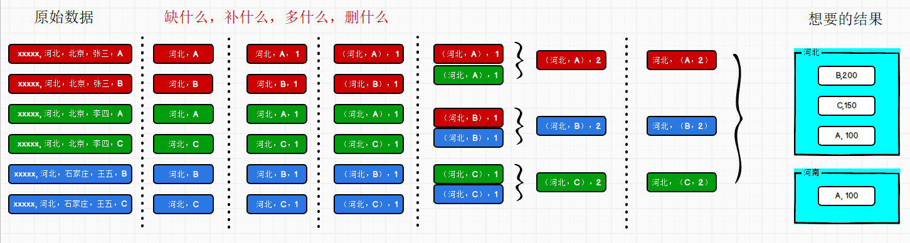
#### [079.SparkCore - 核心编程 - RDD - 案例实操 - 需求设计](https://www.bilibili.com/video/BV11A411L7CK?p=79)
#### [080.SparkCore - 核心编程 - RDD - 案例实操 - 功能实现](https://www.bilibili.com/video/BV11A411L7CK?p=80)
#### [081.SparkCore - 核心编程 - RDD - 行动算子 - 介绍](https://www.bilibili.com/video/BV11A411L7CK?p=81)
#### [082.SparkCore - 核心编程 - RDD - 行动算子 - 算子演示](https://www.bilibili.com/video/BV11A411L7CK?p=82)
#### [083.SparkCore - 核心编程 - RDD - 行动算子 - aggregate](https://www.bilibili.com/video/BV11A411L7CK?p=83)
#### [084.SparkCore - 核心编程 - RDD - 行动算子 - countByKey & countByValue](https://www.bilibili.com/video/BV11A411L7CK?p=84)
#### [085.SparkCore - 核心编程 - RDD - WordCount不同的实现方式 - (1-8)](https://www.bilibili.com/video/BV11A411L7CK?p=85)
#### [086.SparkCore - 核心编程 - RDD - WordCount不同的实现方式 - (9-11)](https://www.bilibili.com/video/BV11A411L7CK?p=86)
#### [087.SparkCore - 核心编程 - RDD - 行动算子 - save的方法](https://www.bilibili.com/video/BV11A411L7CK?p=87)
#### [088.SparkCore - 核心编程 - RDD - 行动算子 - foreach](https://www.bilibili.com/video/BV11A411L7CK?p=88)
#### [089.SparkCore - 核心编程 - RDD - 序列化 - 闭包检测](https://www.bilibili.com/video/BV11A411L7CK?p=89)
#### [090.SparkCore - 核心编程 - RDD - 序列化 - 实际执行时的问题](https://www.bilibili.com/video/BV11A411L7CK?p=90)
#### [091.SparkCore - 核心编程 - RDD - 序列化 - Kryo序列化Core介绍](https://www.bilibili.com/video/BV11A411L7CK?p=91)
#### [092.SparkCore - 核心编程 - RDD - 依赖关系 - 依赖 & 血缘关系介绍](https://www.bilibili.com/video/BV11A411L7CK?p=92)
#### [093.SparkCore - 核心编程 - RDD - 依赖关系 - 血缘关系 - 演示](https://www.bilibili.com/video/BV11A411L7CK?p=93)
#### [094.SparkCore - 核心编程 - RDD - 依赖关系 - 宽窄依赖](https://www.bilibili.com/video/BV11A411L7CK?p=94)
#### [095.SparkCore - 核心编程 - RDD - 依赖关系 - 阶段&分区&任务 - 概念解析 - 秋游了](https://www.bilibili.com/video/BV11A411L7CK?p=95)
#### [096.SparkCore - 核心编程 - RDD - 依赖关系 - 阶段划分源码解读](https://www.bilibili.com/video/BV11A411L7CK?p=96)
#### [097.SparkCore - 核心编程 - RDD - 依赖关系 - 任务划分源码解读](https://www.bilibili.com/video/BV11A411L7CK?p=97)
#### [098.SparkCore - 核心编程 - RDD - 依赖关系 - 任务分类](https://www.bilibili.com/video/BV11A411L7CK?p=98)
#### [099.SparkCore - 核心编程 - RDD - 持久化 - cache & persist基本原理和演示](https://www.bilibili.com/video/BV11A411L7CK?p=99)
#### [100.SparkCore - 核心编程 - RDD - 持久化 - 作用](https://www.bilibili.com/video/BV11A411L7CK?p=100)
#### [101.SparkCore - 核心编程 - RDD - 持久化 - 检查点](https://www.bilibili.com/video/BV11A411L7CK?p=101)
#### [102.SparkCore - 核心编程 - RDD - 持久化 - 区别](https://www.bilibili.com/video/BV11A411L7CK?p=102)
#### [103.SparkCore - 核心编程 - RDD - 分区器 - 自定义数据分区规则](https://www.bilibili.com/video/BV11A411L7CK?p=103)
#### [104.SparkCore - 核心编程 - RDD - 文件读取与保存](https://www.bilibili.com/video/BV11A411L7CK?p=104)
运行 Spark01_RDD_IO_Save.java 以不同的方式将数据保存到 output1、output2、output3 文件目录下
再运行 Spark01_RDD_IO_Load.java 将save保存的文件 加载到内存中
#### [105.SparkCore - 核心编程 - 数据结构 -累加器 - 原理及简单演示](https://www.bilibili.com/video/BV11A411L7CK?p=105)
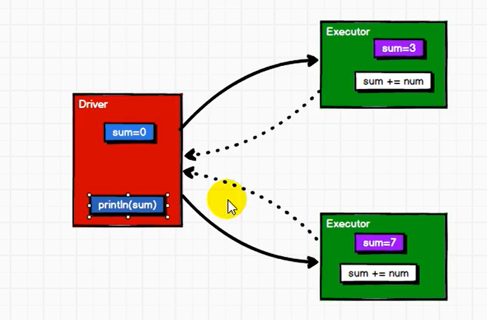
#### [106.SparkCore - 核心编程 - 数据结构 -累加器 - 问题](https://www.bilibili.com/video/BV11A411L7CK?p=106)
#### [107.SparkCore - 核心编程 - 数据结构 -累加器 - 自定义实现](https://www.bilibili.com/video/BV11A411L7CK?p=107)
#### [108.SparkCore - 核心编程 - 数据结构 -累加器 - 自定义实现 - 1](https://www.bilibili.com/video/BV11A411L7CK?p=108)
#### [109.SparkCore - 核心编程 - 数据结构 - 广播变量](https://www.bilibili.com/video/BV11A411L7CK?p=109)
#### [110.SparkCore - 案例实操 - 数据准备 & 数据说明](https://www.bilibili.com/video/BV11A411L7CK?p=110)
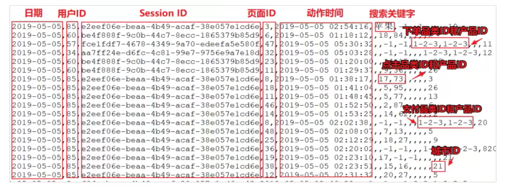
#### [111.SparkCore - 案例实操 - 需求一 - 需求设计 & 思路梳理](https://www.bilibili.com/video/BV11A411L7CK?p=111)
#### [112.SparkCore - 案例实操 - 需求一 - 功能实现 - 分别统计点击，下单，支付的数量](https://www.bilibili.com/video/BV11A411L7CK?p=112)
#### [113.SparkCore - 案例实操 - 需求一 - 功能实现 - 合并点击，下单，支付的数量](https://www.bilibili.com/video/BV11A411L7CK?p=113)
#### [114.SparkCore - 案例实操 - 需求一 - 功能实现 - 第二种实现方式](https://www.bilibili.com/video/BV11A411L7CK?p=114)
#### [115.SparkCore - 案例实操 - 需求一 - 功能实现 - 第三种实现方式](https://www.bilibili.com/video/BV11A411L7CK?p=115)
#### [116.SparkCore - 案例实操 - 需求一 - 功能实现 - 第四种实现方式](https://www.bilibili.com/video/BV11A411L7CK?p=116)
#### [117.SparkCore - 案例实操 - 需求二 - 功能实现](https://www.bilibili.com/video/BV11A411L7CK?p=117)
#### [118.SparkCore - 案例实操 - 需求三 - 需求介绍](https://www.bilibili.com/video/BV11A411L7CK?p=118)
#### [119.SparkCore - 案例实操 - 需求三 - 需求分析 - 图解](https://www.bilibili.com/video/BV11A411L7CK?p=119)
#### [120.SparkCore - 案例实操 - 需求三 - 代码实现 - 分母的计算](https://www.bilibili.com/video/BV11A411L7CK?p=120)
#### [121.SparkCore - 案例实操 - 需求三 - 代码实现 - 分子的计算并求转换率](https://www.bilibili.com/video/BV11A411L7CK?p=121)
#### [122.SparkCore - 案例实操 - 需求三 - 代码实现 - 优化需求](https://www.bilibili.com/video/BV11A411L7CK?p=122)
#### [123.SparkCore - 工程化代码 - 架构模式 - 三层架构介绍](https://www.bilibili.com/video/BV11A411L7CK?p=123)
#### [124.SparkCore - 工程化代码 - 架构模式 - 三层架构代码实现](https://www.bilibili.com/video/BV11A411L7CK?p=124)
#### [125.SparkCore - 工程化代码 - 架构模式 - 架构代码优化](https://www.bilibili.com/video/BV11A411L7CK?p=125)
#### [126.SparkCore - 工程化代码 - 架构模式 - ThreadLocal解释](https://www.bilibili.com/video/BV11A411L7CK?p=126)
#### [127.SparkCore - 总结 - 课件梳理](https://www.bilibili.com/video/BV11A411L7CK?p=127)
#### [128.Spark内核 & 源码 - 总体介绍](https://www.bilibili.com/video/BV11A411L7CK?p=128)
#### [129.Spark内核 & 源码 - 环境准备 - SparkSubmit - 起点](https://www.bilibili.com/video/BV11A411L7CK?p=129)
#### [130.Spark内核 & 源码 - 环境准备 - SparkSubmit - 向Yarn提交应用](https://www.bilibili.com/video/BV11A411L7CK?p=130)
#### [131.Spark内核 & 源码 - 环境准备 - SparkSubmit - 启动ApplicationMaster](https://www.bilibili.com/video/BV11A411L7CK?p=131)
#### [132.Spark内核 & 源码 - 环境准备 - ApplicationMaster - 启动Driver线程](https://www.bilibili.com/video/BV11A411L7CK?p=132)
#### [133.Spark内核 & 源码 - 环境准备 - ApplicationMaster - 启动Executor进程](https://www.bilibili.com/video/BV11A411L7CK?p=133)
#### [134.Spark内核 & 源码 - 环境准备 - ExecutorBackend - 创建Executor计算对象](https://www.bilibili.com/video/BV11A411L7CK?p=134)
#### [135.Spark内核 & 源码 - 环境准备 - 流程梳理](https://www.bilibili.com/video/BV11A411L7CK?p=135)
#### [136.Spark内核 & 源码 - 通信环境 - 通信原理](https://www.bilibili.com/video/BV11A411L7CK?p=136)
#### [137.Spark内核 & 源码 - 通信环境 - 通信组件](https://www.bilibili.com/video/BV11A411L7CK?p=137)
#### [138.Spark内核 & 源码 - 通信环境 - 课件梳理](https://www.bilibili.com/video/BV11A411L7CK?p=138)
#### [139.Spark内核 & 源码 - 应用程序执行 - 上下文对象SparkContext](https://www.bilibili.com/video/BV11A411L7CK?p=139)
#### [140.Spark内核 & 源码 - 应用程序执行 - RDD依赖关系](https://www.bilibili.com/video/BV11A411L7CK?p=140)
#### [141.Spark内核 & 源码 - 应用程序执行 - 阶段的划分](https://www.bilibili.com/video/BV11A411L7CK?p=141)
#### [142.Spark内核 & 源码 - 应用程序执行 - 任务的切分](https://www.bilibili.com/video/BV11A411L7CK?p=142)
#### [143.Spark内核 & 源码 - 应用程序执行 - 任务的调度](https://www.bilibili.com/video/BV11A411L7CK?p=143)
#### [144.Spark内核 & 源码 - 应用程序执行 - 任务的执行](https://www.bilibili.com/video/BV11A411L7CK?p=144)
#### [145.Spark内核 & 源码 - 应用程序执行 - 课件梳理](https://www.bilibili.com/video/BV11A411L7CK?p=145)
#### [146.Spark内核 & 源码 - shuffle - 原理回顾](https://www.bilibili.com/video/BV11A411L7CK?p=146)
#### [147.Spark内核 & 源码 - shuffle - 图解](https://www.bilibili.com/video/BV11A411L7CK?p=147)
#### [148.Spark内核 & 源码 - shuffle - 实现过程](https://www.bilibili.com/video/BV11A411L7CK?p=148)
#### [149.Spark内核 & 源码 - shuffle - 写流程源码解读](https://www.bilibili.com/video/BV11A411L7CK?p=149)
#### [150.Spark内核 & 源码 - shuffle - 归并排序和读流程](https://www.bilibili.com/video/BV11A411L7CK?p=150)
#### [151.Spark内核 & 源码 - shuffle - 课件梳理](https://www.bilibili.com/video/BV11A411L7CK?p=151)
#### [152.Spark内核 & 源码 - 内存管理](https://www.bilibili.com/video/BV11A411L7CK?p=152)
#### [153.SparkSQL - 介绍](https://www.bilibili.com/video/BV11A411L7CK?p=153)
#### [154.SparkSQL - 特点](https://www.bilibili.com/video/BV11A411L7CK?p=154)
#### [155.SparkSQL - 数据模型 - DataFrame & DataSet](https://www.bilibili.com/video/BV11A411L7CK?p=155)
#### [156.SparkSQL - 核心编程 - DataFrame - 简单演示](https://www.bilibili.com/video/BV11A411L7CK?p=156)
#### [157.SparkSQL - 核心编程 - DataFrame - SQL的基本使用](https://www.bilibili.com/video/BV11A411L7CK?p=157)
#### [158.SparkSQL - 核心编程 - DataFrame - DSL语法的基本使用](https://www.bilibili.com/video/BV11A411L7CK?p=158)
#### [159.SparkSQL - 核心编程 - DataFrame - RDD之间的转换](https://www.bilibili.com/video/BV11A411L7CK?p=159)
#### [160.SparkSQL - 核心编程 - DataSet - 介绍](https://www.bilibili.com/video/BV11A411L7CK?p=160)
#### [161.SparkSQL - 核心编程 - DataSet - DataFrame的转换](https://www.bilibili.com/video/BV11A411L7CK?p=161)
#### [162.SparkSQL - 核心编程 - DataSet - RDD的转换](https://www.bilibili.com/video/BV11A411L7CK?p=162)
#### [163.SparkSQL - 核心编程 - DataSet & DataFrame & RDD之间的关系](https://www.bilibili.com/video/BV11A411L7CK?p=163)
#### [164.SparkSQL - 核心编程 - IDEA创建SparkSQL环境对象](https://www.bilibili.com/video/BV11A411L7CK?p=164)
#### [165.SparkSQL - 核心编程 - IDEA - DataFrame基本操作](https://www.bilibili.com/video/BV11A411L7CK?p=165)
#### [166.SparkSQL - 核心编程 - IDEA - DataSet基本操作](https://www.bilibili.com/video/BV11A411L7CK?p=166)
#### [167.SparkSQL - 核心编程 - IDEA - RDD & DataFrame & DataSet互相转换](https://www.bilibili.com/video/BV11A411L7CK?p=167)
#### [168.SparkSQL - 核心编程 - IDEA - UDF函数](https://www.bilibili.com/video/BV11A411L7CK?p=168)
#### [169.SparkSQL - 核心编程 - IDEA - UDAF函数 - 实现原理](https://www.bilibili.com/video/BV11A411L7CK?p=169)
#### [170.SparkSQL - 核心编程 - IDEA - UDAF函数 - 弱类型函数实现](https://www.bilibili.com/video/BV11A411L7CK?p=170)
#### [171.SparkSQL - 核心编程 - IDEA - UDAF函数 - 强类型函数实现](https://www.bilibili.com/video/BV11A411L7CK?p=171)
#### [172.SparkSQL - 核心编程 - IDEA - UDAF函数 - 早期强类型函数实现](https://www.bilibili.com/video/BV11A411L7CK?p=172)
#### [173.SparkSQL - 核心编程 - IDEA - UDAF函数 - 课件梳理](https://www.bilibili.com/video/BV11A411L7CK?p=173)
#### [174.SparkSQL - 核心编程 - 数据读取和保存 - 通用方法](https://www.bilibili.com/video/BV11A411L7CK?p=174)
#### [175.SparkSQL - 核心编程 - 数据读取和保存 - 操作JSON & CSV](https://www.bilibili.com/video/BV11A411L7CK?p=175)
#### [176.SparkSQL - 核心编程 - 数据读取和保存 - 操作MySQL](https://www.bilibili.com/video/BV11A411L7CK?p=176)
#### [177.SparkSQL - 核心编程 - 数据读取和保存 - 操作内置Hive](https://www.bilibili.com/video/BV11A411L7CK?p=177)
#### [178.SparkSQL - 核心编程 - 数据读取和保存 - 操作外置Hive](https://www.bilibili.com/video/BV11A411L7CK?p=178)
#### [179.SparkSQL - 核心编程 - 数据读取和保存 - 代码操作外置Hive](https://www.bilibili.com/video/BV11A411L7CK?p=179)
#### [180.SparkSQL - 核心编程 - 数据读取和保存 - beeline操作Hive](https://www.bilibili.com/video/BV11A411L7CK?p=180)
#### [181.SparkSQL - 案例实操 - 数据准备](https://www.bilibili.com/video/BV11A411L7CK?p=181)
#### [182.SparkSQL - 案例实操 - 需求部分实现](https://www.bilibili.com/video/BV11A411L7CK?p=182)
#### [183.SparkSQL - 案例实操 - 需求完整实现](https://www.bilibili.com/video/BV11A411L7CK?p=183)
#### [184.SparkSQL - 总结 - 课件梳理](https://www.bilibili.com/video/BV11A411L7CK?p=184)
#### [185.SparkStreaming - 概念 - 介绍](https://www.bilibili.com/video/BV11A411L7CK?p=185)
#### [186.SparkStreaming - 概念 - 原理 & 特点](https://www.bilibili.com/video/BV11A411L7CK?p=186)
#### [187.SparkStreaming - 入门 - WordCount - 实现](https://www.bilibili.com/video/BV11A411L7CK?p=187)
下载安装netcat工具，用于模拟向指定端口发送数据
下载地址：https://eternallybored.org/misc/netcat/
安装时需要关闭杀毒软件，或者在杀毒软件中信任该软件，否则会被杀毒软件当做病毒，其中的 .exe 文件会被删除
启动 netcat 向9999端口发送数据
```shell
E:\software\tools\netcat-win32-1.12>nc -lp 9999
```
在启动 SparkStreaming01_WordCount 程序
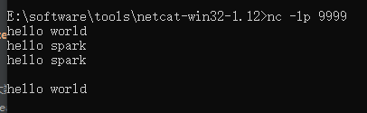
#### [188.SparkStreaming - 入门 - WordCount - 解析](https://www.bilibili.com/video/BV11A411L7CK?p=188)
#### [189.SparkStreaming - DStream创建 - Queue](https://www.bilibili.com/video/BV11A411L7CK?p=189)
#### [190.SparkStreaming - DStream创建 - 自定义数据采集器](https://www.bilibili.com/video/BV11A411L7CK?p=190)
#### [191.SparkStreaming - DStream创建 - Socket数据采集器源码解读](https://www.bilibili.com/video/BV11A411L7CK?p=191)
#### [192.SparkStreaming - DStream创建 - Kafka数据源](https://www.bilibili.com/video/BV11A411L7CK?p=192)
```shell
# 查看kafka topic 列表
bin/kafka-topics.sh --list --zookeeper 192.168.6.180:2181
# 创建 spark-learn-topic topic (或者启动消费者的代码后会自动创建该topic)
bin/kafka-topics.sh --create --zookeeper 192.168.6.180:2181 --replication-factor 3 --partitions 4 --topic spark-learn-topic
# 使用命令启动生产者，向 spark-learn-topic 主题中发送数据
bin/kafka-console-producer.sh --broker-list 192.168.6.180:9092 --topic spark-learn-topic
```
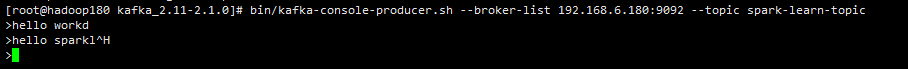
SparkStreaming04_Kafka 程序的控制台中日志可以看到spark消费到了kafka中的数据
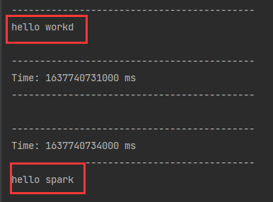
#### [193.SparkStreaming - DStream转换 - 状态操作](https://www.bilibili.com/video/BV11A411L7CK?p=193)
```shell
C:\Users\TRXK-01>nc -lp 9999
```
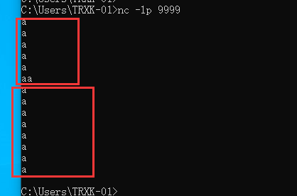
控制台中数据的为所有批次的汇总结果，而不是单个批次的结果，区别于 SparkStreaming01_WordCount.java 中的日志输出
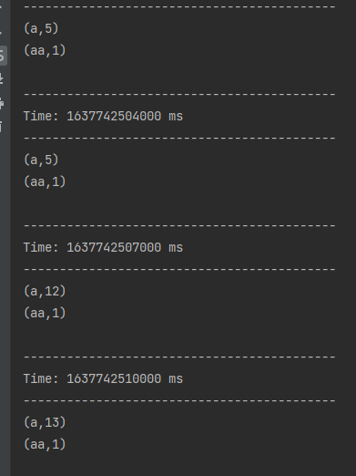
#### [194.SparkStreaming - DStream转换 - 无状态操作 - transform](https://www.bilibili.com/video/BV11A411L7CK?p=194)
#### [195.SparkStreaming - DStream转换 - 无状态操作 - join](https://www.bilibili.com/video/BV11A411L7CK?p=195)
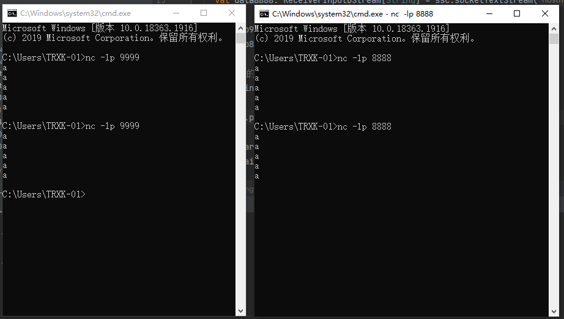
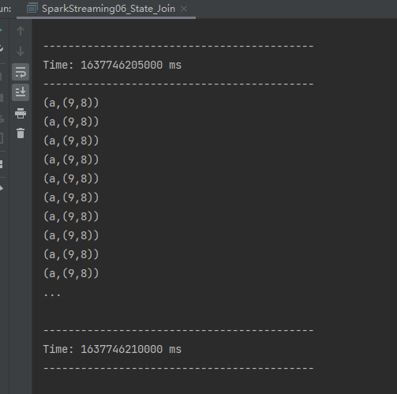
#### [196.SparkStreaming - DStream转换 - 有状态操作 - window](https://www.bilibili.com/video/BV11A411L7CK?p=196)
#### [197.SparkStreaming - DStream转换 - 有状态操作 - window - 补充](https://www.bilibili.com/video/BV11A411L7CK?p=197)
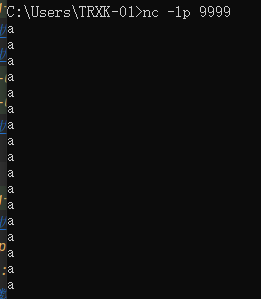
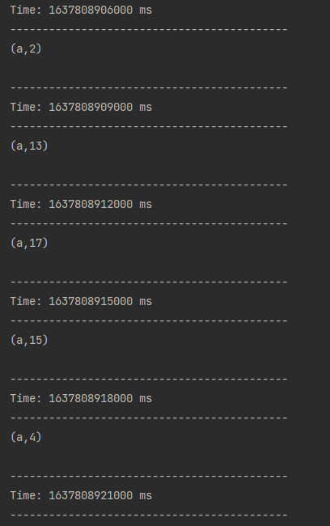
#### [198.SparkStreaming - DStream输出](https://www.bilibili.com/video/BV11A411L7CK?p=198)
#### [199.SparkStreaming - 优雅地关闭](https://www.bilibili.com/video/BV11A411L7CK?p=199)
#### [200.SparkStreaming - 优雅地关闭 - 恢复数据](https://www.bilibili.com/video/BV11A411L7CK?p=200)
#### [201.SparkStreaming - 案例实操 - 环境和数据准备](https://www.bilibili.com/video/BV11A411L7CK?p=201) 